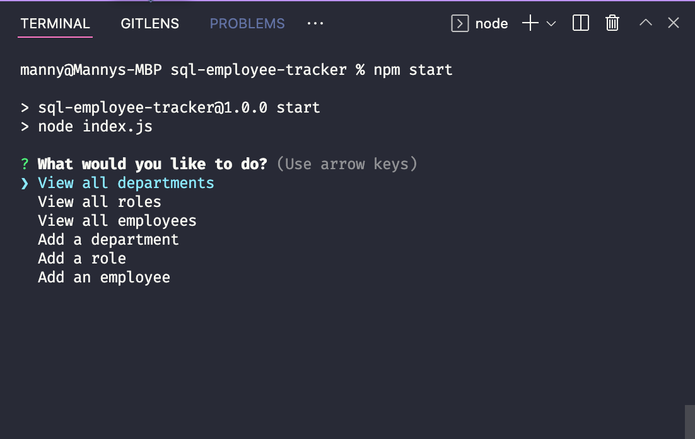
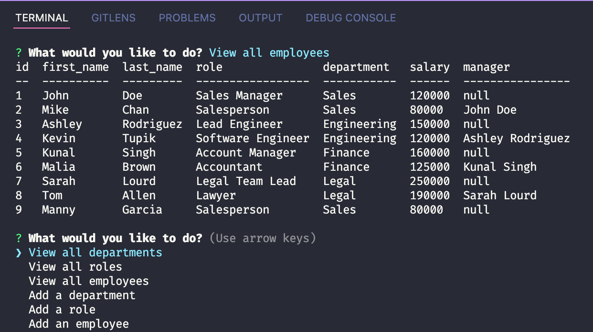

  

![license-badge]

  <h1 align="center">SQL Employee Tracker</h1>
  
  <!-- TABLE OF CONTENTS -->
  

    
Table of Contents

    <ul>
      <li><a href="#description">Description</a></li>
      <li><a href="#installation">Installation</a></li>
      <li><a href="#usage">Usage</a></li>
      <li><a href="#contributing">Contributing</a></li>
      <li><a href="#tests">Tests</a></li>
      <li><a href="#license">License</a></li>
      <li><a href="#questions">Questions</a></li>
    </ul>
  

   
  
  
  
  ## Description
  SQL Employee Tracker is a command-line content management system to manager a company's employee database.
  
  ## Installation
1. Clone the repository
2. Run npm install in the root directory
3. Create a .env file and enter MySQL credentials (the database name is "employee_db")
4. Seed the directory by running MySQL shell and running source db/schema.sql.
5. Run npm start
6. You will be given several options for navigating your employee database.

A walkthrough video can be found [here](https://drive.google.com/file/d/1Ikz0qpZLZn1ui6WQYx7RixUifKKGU85q/view)

## Usage

This application can be used for company's of all sizes to keep track of employees' roles, salary, and managers. Various SQL queries are run depending on the user's response to the prompts.

## Contributing

Fork the repository, add a feature, then submit a pull request.

## Tests

N/A

## License

Licensed under the MIT License.

## Questions

Email: [mannysg88@gmail.com](mailto:mannysg88@gmail.com)

Github: [https://github.com/mannygarcia98](https://github.com/mannygarcia98)

  <!-- MARKDOWN LINKS & IMAGES -->

[license-badge]: https://img.shields.io/badge/LICENSE-MIT-brightgreen?style=plastic
